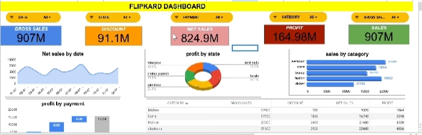

. Flipkart Sales Dashboard
Dashboard preview

. Project Overview

This project is an interactive Flipkart Sales Dashboard created using Microsoft Excel. It provides insights into sales performance, profit, discounts, payment methods, and category-wise sales through dynamic charts and interactive filters.

. Features

 .Sales Dashboard

 .Gross Sales & Net Sales Analysis

 .Sales Trend by Date

 .Discount Analysis

 .Category-wise Sales Performance

 .Payment Method Analysis

 .Profit Analysis by State

.Interactive Filters (Date, State, Payment, Category, Gross Sales)

 .Tools Used

.Microsoft Excel

.Pivot Tables

.Pivot Charts

.Slicers

.Data Cleaning

. Files

flipkart_dashboard.xlsx

flipkart_dashboard.jpg

. Author

SRI VITHIYA.M
CSE
